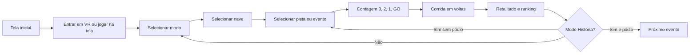

# F-Zone VR — Game Design Document

- **Versão:** 1.0
- **Atualizado em:** 17 de agosto de 2026
- **Estado:** protótipo jogável em evolução
- **Plataformas:** navegador desktop e Meta Quest 3 via WebXR

## 1. Visão

F-Zone VR é um jogo original de corrida antigravitacional futurista, inspirado pela velocidade, leitura de pista e personalidade de máquinas dos clássicos do gênero. A experiência combina controle lateral com inércia, pistas aéreas extensas, rivais agressivos e um cockpit legível em realidade virtual.

O objetivo é entregar corridas curtas o bastante para repetir e longas o bastante para criar narrativa: largada, disputa por posição, domínio da pista, uso tático de energia e uma chegada com resultado claro. A meta por corrida é aproximadamente **2 a 4 minutos**, dependendo de nave, pista e habilidade.

## 2. Pilares

1. **Velocidade com controle** — a nave deve parecer extremamente rápida, mas obedecer imediatamente à intenção lateral do jogador.
2. **Circuitos memoráveis** — cada pista tem silhueta, clima, cores, elevação e desafios próprios; não é apenas outra curva com nova cor.
3. **Cockpit que pertence à nave** — no VR, painel, carenagem e HUD são parte física da máquina escolhida, sem prender o movimento natural da cabeça.
4. **Rivalidade legível** — adversários têm presença na pista, colisão, nomes, posição e comportamento competitivo compreensível.
5. **Conforto antes do espetáculo** — inclinações e velocidade podem impressionar sem impor giros bruscos de câmera ou inversões gratuitas.

## 3. Público e formato

- Jogadores de corrida arcade e ficção científica.
- Sessões rápidas, com espaço para campanha e campeonatos.
- Jogável com teclado, gamepad e controles do Meta Quest.
- Sem necessidade de instalação: distribuição principal por HTTPS no GitHub Pages.
- Partidas atuais para um jogador; modo VS é futuro.

## 4. Fluxo principal

Depois que o jogador entra em VR, menus, seleção, corrida e resultados devem permanecer dentro da mesma sessão imersiva. Sair do VR só acontece por ação explícita do jogador ou encerramento do navegador.

## 5. Modos de jogo

| Modo | Estado | Regras |
| --- | --- | --- |
| História | Implementado, em expansão | Cinco eventos em sequência. É necessário terminar entre 1º e 3º para avançar. Cada evento destaca um rival. |
| Arcade | Implementado | Corrida isolada, sem rival obrigatório, com escolha livre de nave e pista. |
| Cup | Parcial | Corridas com adversários já funcionam; pontuação acumulada e cerimônia final ainda serão aprofundadas. |
| Opções | Implementado | Controles independentes de volume geral, música e efeitos. |
| VS | Planejado | Competição entre jogadores; arquitetura e rede ainda não definidas. |

### Campanha atual

| Evento | Circuito | Rival | Voltas | Condição de avanço |
| --- | --- | --- | ---: | --- |
| 1 — Primeira Centelha | Helix Verge | Nyx Calder | 4 | Pódio |
| 2 — Dívida Zenith | Rift Ascent | Juno Vale | 4 | Pódio |
| 3 — Linha de Ferro | Solar Foundry | Rook Mercer | 4 | Pódio |
| 4 — Bloqueio Violeta | Magma Crown | Iris Kade | 5 | Pódio |
| 5 — Coroa Solar | Cloudline Metro | Sol Renn | 5 | Pódio |

Cada evento possui um circuito fixo e a campanha avança na ordem Helix Verge, Rift Ascent, Solar Foundry, Magma Crown e Cloudline Metro. O botão de próxima corrida deve sempre carregar o circuito associado ao novo evento, tanto na tela quanto no VR.

## 6. Estrutura de uma corrida

1. Grid de largada e apresentação breve.
2. Contagem visual **3, 2, 1, GO** sem contador duplicado.
3. Aceleração, disputa lateral e primeira curva.
4. Gestão de trajetória, vácuo, colisões, boost pads e energia.
5. Voltas com cronômetro e posição atualizados.
6. Última volta claramente sinalizada.
7. Linha de chegada, desaceleração e tela de resultados.
8. Ranking final antes de repetir, avançar ou voltar ao menu.

## 7. Pilotagem

### Sensação desejada

- Direção lateral responsiva, com inércia suficiente para comunicar massa.
- O jogador escolhe a linha dentro de uma pista larga; a nave não deve apenas seguir um trilho invisível.
- A assistência central evita perda total do circuito, mas não elimina erro, ultrapassagem ou contato com barreiras.
- Frenagem ajuda em curvas e correções, não é só uma redução cosmética no velocímetro.
- O cockpit acompanha inclinação e guinada da nave; a câmera respeita o rastreamento independente da cabeça.

### Velocidade

- O HUD apresenta km/h de forma estável e deve zerar quando a nave para.
- As classes atuais trabalham com leitura máxima próxima de **400 a 600 km/h** em condição normal.
- Nitro pode ultrapassar temporariamente a velocidade base, preservando legibilidade.
- O número exibido deriva do estado físico da nave, sem acumular entre corridas.

### Colisões e interação

- Naves possuem volume de colisão e podem disputar espaço.
- Contato lateral transfere impulso e prejudica a linha, sem travar permanentemente veículos.
- Barreiras reduzem velocidade e devolvem a nave à área segura.
- Cair em uma lacuna aciona recuperação controlada em ponto válido.
- Vácuo atrás de oponentes fornece vantagem pequena e intencional.

## 8. Energia, nitro e pista

- Nitro é um recurso finito; não se regenera infinitamente sozinho durante a corrida.
- Trechos de recarga nas bordas devolvem energia gradualmente e exigem escolha de linha.
- Caixas holográficas de armamento ocupam linhas alternadas e reaparecem após sete segundos.
- Usar nitro ativa áudio próprio e efeito visual periférico sem encobrir o centro da pista.
- Cada escapamento emite partículas de plasma que percorrem o rastro, tremulam, expandem e se dissipam proporcionalmente à velocidade. No nitro, o fluxo fica mais longo, turbulento e luminoso; rivais conservam rastros menores para leitura de movimento. A mesma animação aparece nas vitrines 3D de seleção na tela e no VR.
- Estado de energia e nitro é reiniciado corretamente a cada nova corrida.
- No VR, posição do jogador e volta atual ficam integradas ao painel físico do velocímetro, presas ao cockpit junto de velocidade, vidas, armas e energia.
- Todas as pistas possuem setores de borda aberta sinalizados por marcadores vermelhos e pela interrupção dos guard-rails. Ultrapassar a largura do asfalto inicia uma queda breve, ignora o escudo, consome uma vida e restaura a nave ao centro após um segundo; a terceira queda elimina o jogador.

### Combate de pista

- Cada nave começa com três vidas. Um ataque sem proteção destrói a nave, consome uma vida e inicia renascimento de um segundo.
- Ao perder a terceira vida, a nave é eliminada e sua corrida termina automaticamente.
- A caixa sorteia com probabilidade uniforme uma das três armas iniciais.
- **Metralhadora:** vinte projéteis luminosos; no VR a arma acompanha a mão direita e dispara na direção apontada.
- **Míssil teleguiado:** um disparo que seleciona e persegue o adversário mais próximo à frente.
- **Escudo prismático:** domo semitransparente que absorve dois ataques sem encobrir o centro de visão do cockpit.
- O jogador possui dois slots. Uma caixa preenche o primeiro vazio ou substitui o slot ativo quando ambos estão ocupados; ativar o escudo não bloqueia o segundo item.
- Rivais coletam caixas, usam as mesmas armas, perdem vidas, explodem, renascem e podem ser eliminados.
- O estado de arma, munição, escudo, vidas, projéteis e caixas deve ser limpo entre corridas e trocas de pista.

## 9. Naves

Cada nave precisa ser reconhecível pela silhueta externa, cockpit, carenagem, cores, painel e comportamento. Trocar de nave não pode ser apenas trocar o nome ou a cor.

Escala dos atributos: 1 a 5.

| Nave | Arquétipo | Aceleração | Velocidade final | Controle | Boost | Estrutura |
| --- | --- | ---: | ---: | ---: | ---: | ---: |
| Astra V9 | Equilibrada | 4 | 4 | 4 | 3 | 3 |
| Kestrel RX | Ágil | 5 | 3 | 5 | 3 | 2 |
| Titan Forge | Pesada | 2 | 5 | 2 | 4 | 5 |
| Pulse Wraith | Impulso | 4 | 4 | 3 | 5 | 2 |
| Vanta Grip | Técnica | 3 | 4 | 5 | 2 | 4 |

### Regras visuais das naves

- Silhueta legível a distância para identificar oponentes.
- Cockpit coerente com o arquétipo: leve, pesado, técnico ou focado em boost.
- Materiais com contraste de base, detalhe e emissão; evitar blocos planos sem acabamento.
- Propulsores reagem a aceleração e nitro.
- Seleção em VR deve apresentar modelos tridimensionais, atributos e mudança visível do cockpit.

## 10. Circuitos

| Pista | Estado | Comprimento | Voltas padrão | Identidade |
| --- | --- | ---: | ---: | --- |
| Helix Verge | Implementada | 3,61 km | 4 | Cidade orbital noturna, magenta e ciano, lacunas aéreas e magnetismo. |
| Rift Ascent | Implementada | 5,20 km | 4 | Cordilheira sob aurora boreal, subida de até 31°, dois saltos e curvas magnéticas moderadas. |
| Solar Foundry | Implementada | 6,60 km | 4 | Forja solar diurna, circuito recortado, dutos industriais, elevação progressiva e duas pontes aéreas. |
| Magma Crown | Implementada | 6,13 km | 4 | Caldeira noturna, lago de lava, coroa vulcânica, descida obsidiana e plataformas de resfriamento. |
| Cloudline Metro | Implementada | 7,57 km | 4 | Metrópole clara acima das nuvens, retas extensas, aerovias e um loop vertical completo. |

As regras completas estão em [TRACK-DESIGN.md](TRACK-DESIGN.md). Requisitos centrais:

- largura-base de 48 unidades;
- comprimento mínimo de 3,5 km;
- curvas contínuas, sem vértices em V;
- túneis e trechos sobrepostos com folga real;
- subidas e descidas progressivas;
- saltos alinhados com a recepção;
- inversões somente quando forem parte consciente da identidade da pista;
- mapa derivado da mesma geometria da corrida;
- identidade ambiental própria: cidade, aurora, lava, dia, indústria ou outro tema reconhecível.

## 11. Rivais e inteligência artificial

Rivais atuais: **Nyx Calder, Juno Vale, Rook Mercer, Iris Kade e Sol Renn**.

Objetivos da IA:

- largar, ultrapassar e defender linhas sem parecer presa a um comboio;
- cometer pequenas variações e permitir recuperação do jogador;
- escalar por evento, nave e dificuldade;
- respeitar colisões, lacunas, energia e linha de chegada;
- manter primeiro lugar desafiador, mas atingível com boa pilotagem;
- evitar vantagens invisíveis permanentes; qualquer recuperação elástica deve ser limitada e testável.

O ranking considera progresso total — volta mais posição no circuito — e aparece no HUD, minimapa e resultado final.

## 12. Interface e experiência VR

### Desktop

- HUD periférico com posição, volta, tempo, melhor volta, velocidade, energia e minimapa.
- Pausa oferece retorno, opções e saída para o menu.
- Controles devem funcionar com teclado e gamepad.

### VR

- Menus são painéis espaciais selecionáveis por raios dos dois controles.
- A seleção de circuitos apresenta um turntable 3D da geometria real, incluindo elevação, lacunas e setores especiais.
- Um cursor marca a interseção; gatilho confirma a opção apontada.
- Analógico também permite navegação para acessibilidade e contingência.
- Velocímetro, energia e mapa ficam anexos ao painel da nave, não à cabeça.
- O painel inclina com a nave, enquanto olhar ao redor continua livre.
- O centro da visão permanece desobstruído: sem retícula permanente durante a corrida.
- Feedback háptico confirma interação, boost e impactos quando suportado.

Detalhes e checklist estão em [VR-UX.md](VR-UX.md).

## 13. Controles

| Ação | Teclado | Gamepad | Meta Quest |
| --- | --- | --- | --- |
| Direção | A/D ou setas | Analógico esquerdo | Analógico esquerdo |
| Acelerar | W ou seta para cima | Gatilho direito | Empunhadura direita |
| Frear | S ou seta para baixo | Gatilho esquerdo | Gatilho esquerdo |
| Nitro | Shift ou Espaço | A / ombro direito | A direito |
| Usar/mirar arma | E/F | B | Apontar mão direita + gatilho |
| Trocar slot | Q | Y | B direito |
| Mapa | M | Y / Menu | Botão esquerdo configurado |
| Pausa/voltar | Esc | Menu | Menu/voltar |
| Selecionar em VR | — | — | Apontar e apertar gatilho |

## 14. Áudio

- Música de fundo em loop, carregada de `public/audio/background.mp3`.
- Motor sintetizado reage a aceleração e velocidade sem tom agressivo constante.
- Nitro, colisão, contagem, confirmação, volta e chegada têm sinais distintos.
- Volumes geral, música e efeitos são independentes e persistidos localmente.
- Padrões atuais: geral 72%, música 55%, efeitos 40%.
- O áudio só inicia depois de interação do jogador, respeitando políticas do navegador.

## 15. Direção de arte

### Linguagem geral

- Futurismo de alta velocidade com fundo escuro, ciano elétrico, magenta, âmbar e emissão controlada.
- Formas angulares refinadas, camadas mecânicas e superfícies que respondem à luz.
- Interface técnica legível, com hierarquia forte e pouco ruído no centro da visão.

### Identidade por pista

Cada fase define:

- paleta de pista, barreira e céu;
- horário ou fenômeno atmosférico;
- arquitetura e silhueta de fundo;
- material do asfalto/plataforma;
- assinatura de luz e partículas;
- desafio predominante, como salto, elevação, magnetismo ou largura variável segura.

Trocar apenas a cor do mesmo cenário não conta como nova identidade.

## 16. Conforto e acessibilidade

- Nada força a rotação da cabeça; câmera e cockpit têm responsabilidades separadas.
- Evitar roll de 180° frequente em túneis.
- Inclinações são antecipadas visualmente e aplicadas gradualmente.
- Efeitos de nitro ficam na periferia e não piscam em frequência excessiva.
- Áudio possui controles independentes.
- Menus aceitam apontar, analógico e confirmação física.
- Texto VR deve permanecer legível na distância de uso prevista.
- Recuperação de pista evita telas abruptas ou reposicionamentos desorientadores.

## 17. Estado atual e escopo futuro

### Implementado

- Corrida desktop e WebXR no Meta Quest 3.
- Fluxo de menus antes da corrida e permanência em VR.
- Cinco naves e cinco rivais.
- Cinco pistas, voltas, cronômetro, ranking e resultados.
- Colisões, vácuo, boost, energia, zonas de recarga e minimapa.
- Música, efeitos e opções de volume.
- Publicação automática no GitHub Pages.

### Parcial

- Campanha usa pistas repetidas em eventos posteriores.
- Cup ainda precisa de pontuação acumulada e apresentação própria.
- Diferenciação de IA e refinamento visual das naves continuam em evolução.
- Balanceamento final depende de sessões de teste no Quest.

### Planejado

- Testes de campanha e conforto no Quest para homologar as duas pistas mais recentes.
- Campeonato completo e desbloqueios.
- Mais feedback visual/sonoro por nave e rival.
- Ajustes de conforto configuráveis.
- Modo VS após definição de arquitetura multiplayer.

## 18. Critérios de qualidade

Uma versão está pronta para publicação quando:

- o fluxo completo pode ser concluído em desktop e Meta Quest;
- nenhuma pista se cruza sem folga, fecha em V ou possui parede acidental;
- velocidade, nitro, energia, posição e voltas reiniciam entre corridas;
- todas as naves selecionadas aparecem corretamente por fora e no cockpit;
- menus VR respondem aos dois controles e exibem cursor;
- a IA permite vitória consistente a um jogador habilidoso sem tornar o pódio automático;
- `npm test`, `npm run lint` e `npm run build:pages` passam;
- o endereço publicado carrega estilos, scripts, música e WebXR por HTTPS.

## 19. Fora do escopo imediato

- Simulação realista de voo ou física orbital.
- Mundo aberto.
- Editor público de pistas.
- Economia com dinheiro real.
- Multiplayer antes de estabilizar corrida, pistas, conforto e campanha.
