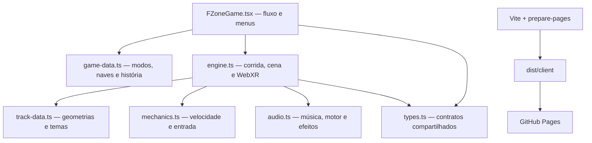

# Design técnico

## 1. Objetivo

Este documento descreve como o F-Zone VR está organizado e quais limites devem ser preservados ao evoluir o protótipo. Ele complementa o [GDD](GDD.md): o GDD explica a experiência; este arquivo explica a implementação.

## 2. Stack e distribuição

- React e TypeScript para interface e fluxo de jogo.
- Three.js para cena, modelos procedurais, pista, câmera e renderização.
- WebXR para sessão imersiva no Meta Quest 3.
- Web Audio API para motor e efeitos sintetizados.
- MP3 local para música de fundo.
- Vinext/Vite para desenvolvimento e build estático.
- Vitest para testes automatizados.
- GitHub Actions e GitHub Pages para publicação.

Requisito local: **Node.js 22.13 ou superior**.

## 3. Arquitetura

## 4. Responsabilidade dos módulos

| Arquivo | Responsabilidade |
| --- | --- |
| `app/game/FZoneGame.tsx` | Estado de tela, entrada no VR, seleção de modo/nave/pista, opções e integração com a engine. |
| `app/game/engine.ts` | Loop principal, cena Three.js, pista, naves, IA, câmera, cockpit, HUD, controles XR e ciclo da corrida. |
| `app/game/game-data.ts` | Catálogo de naves, rivais, modos e eventos da história. |
| `app/game/track-data.ts` | Pontos de controle, setores especiais, tema e metadados dos circuitos. |
| `app/game/mechanics.ts` | Funções determinísticas de entrada e aceleração; principal alvo de testes unitários. |
| `app/game/audio.ts` | Grafo de áudio, música, motor procedural, nitro e preferências de volume. |
| `app/game/types.ts` | Tipos de seleção, HUD, resultado, áudio e integração entre React e engine. |
| `scripts/prepare-pages.mjs` | Prepara a saída estática e caminhos corretos para o GitHub Pages. |

O scaffold contém módulos de servidor/banco não usados pelo runtime do jogo. Eles não devem receber novas dependências até existir uma necessidade de produto, como multiplayer ou placar remoto.

## 5. Estado e ciclo de vida

### Estado de produto

React mantém o fluxo de alto nível: entrada, modo, nave, pista, corrida, resultado e opções. A engine recebe a seleção consolidada e devolve atualizações de HUD e resultado.

### Estado de corrida

A engine possui o estado transitório de uma sessão:

- velocidade e aceleração;
- deslocamento e velocidade lateral;
- progresso normalizado na curva;
- volta, tempo e melhor volta;
- energia/nitro;
- posição de jogador e oponentes;
- estado de contagem, corrida, pausa e chegada;
- controladores XR e alvos de menu.

Todo estado transitório deve ser reiniciado por uma única rotina de início/reinício. Nunca preserve velocidade, nitro, volta, temporizadores ou referências de oponentes entre corridas.

### Ciclo recomendado

1. Criar engine uma vez para o canvas ativo.
2. Configurar modo, nave, pista e rivais.
3. Construir ou reconstruir pista e cenário.
4. Reiniciar estado de corrida.
5. Executar contagem e loop.
6. Emitir resultado.
7. Manter sessão XR e trocar apenas a cena/menu.
8. Descartar recursos somente ao desmontar o jogo ou encerrar XR.

## 6. Pista procedural

Cada pista é uma `TrackLayout` formada por:

- pontos tridimensionais que geram uma curva fechada;
- escala global;
- intervalos de lacunas, magnetismo, recarga e boost;
- setores nomeados;
- tema visual.

A engine amostra atualmente a curva em alta resolução e gera superfície, bordas, colisão, minimapa e orientação a partir da mesma fonte. Novos sistemas nunca devem manter uma segunda versão manual da trajetória.

Constantes de referência atuais:

- largura da pista: **48 unidades**;
- amostras da curva: **720**;
- voltas padrão: **4**;
- distância máxima de câmera: **1800**.

Antes de integrar uma pista, aplicar [todas as regras de design](TRACK-DESIGN.md), inclusive testes de continuidade, separação espacial e fechamento.

## 7. Simulação e movimento

`mechanics.ts` concentra cálculos puros de aceleração e zona morta. O loop da engine combina esses resultados com:

- resposta lateral e amortecimento;
- assistência ao centro da pista;
- colisão de barreira;
- contato entre veículos;
- vácuo;
- boost e energia;
- recuperação após queda;
- orientação tangente, inclinação e magnetismo.

Regras técnicas:

- usar `delta time` limitado para evitar saltos após aba suspensa;
- exibir velocidade derivada do estado atual, não de distância acumulada;
- desacoplar movimento da cabeça da orientação visual da nave;
- manter cálculos determinísticos em funções pequenas sempre que possível;
- aplicar limites antes de atualizar HUD e áudio.

## 8. WebXR

A sessão imersiva é solicitada com `immersive-vr`. Recursos opcionais incluem referências de piso, espaço limitado e rastreamento de mãos quando disponíveis. A renderização usa a câmera XR do Three.js e foveation configurada para equilibrar definição e desempenho.

### Controladores

- Registrar `connected`, `disconnected`, `selectstart` e `selectend` para cada fonte.
- Atualizar raios a partir da pose real a cada frame.
- Raycast somente contra alvos do menu ativo.
- Exibir cursor na primeira interseção válida.
- Remover raios/cursor durante corrida, exceto quando um menu espacial estiver aberto.
- Tratar os dois controles; não depender de uma mão fixa.

### Sessão contínua

Trocar de menu ou iniciar outra corrida não encerra a sessão XR. HTML externo pode continuar como espelho, mas toda ação necessária precisa existir no espaço imersivo.

## 9. Cockpit e câmera

O cockpit é ancorado ao referencial da nave. Ele acompanha parte da guinada e da inclinação para transmitir movimento, além de deslocamento provocado pela inércia lateral. A cabeça continua livre dentro do referencial XR.

Valores atuais de referência:

- acompanhamento de guinada: aproximadamente 62%;
- acompanhamento de inclinação: aproximadamente 82%;
- HUD anexado ao painel, abaixo da linha principal de visão.

Alterações devem ser testadas no headset: uma composição confortável no monitor pode ocupar visão demais em estéreo.

## 10. Áudio e persistência

O `AudioDirector` cria barramentos separados para geral, música e efeitos. O motor é procedural; música usa `/audio/background.mp3` e respeita o prefixo de assets do Pages.

Preferências são persistidas em `localStorage` com a chave `f-zone-vr-audio-settings`. Não persistir estado de corrida nessa mesma chave.

Regras:

- inicializar ou retomar o `AudioContext` após gesto do usuário;
- interromper fontes e desconectar nós ao descartar a engine;
- suavizar frequência e ganho do motor;
- não criar um novo loop de música em cada tela;
- falha ao carregar música não pode impedir a corrida.

## 11. Desempenho no Quest

- Reutilizar geometrias e materiais sempre que possível.
- Evitar alocação por frame no loop de renderização.
- Limitar transparências sobrepostas, partículas e luzes dinâmicas.
- Preferir modelos procedurais de baixa complexidade com boa silhueta.
- Descartar geometria, material, textura e listeners quando reconstruídos.
- Manter efeitos de pós-processamento opcionais ou muito baratos.
- Validar diretamente no Quest; desempenho desktop não é referência suficiente.

## 12. Como adicionar conteúdo

### Nova nave

1. Adicionar metadados e atributos em `game-data.ts`.
2. Criar silhueta externa e cockpit distintos na engine.
3. Mapear atributos para aceleração, velocidade, controle, boost e resistência.
4. Adicionar ao menu desktop e à galeria VR.
5. Testar jogador, IA, resultado e reinício com a nave.
6. Atualizar GDD e QA.

### Nova pista

1. Ler e cumprir `TRACK-DESIGN.md`.
2. Criar layout e tema em `track-data.ts`.
3. Declarar setores especiais como intervalos normalizados.
4. Validar comprimento, continuidade, inclinação e separação.
5. Conferir pista, minimapa, IA, recuperação e colisão.
6. Rodar corrida completa em desktop e VR.
7. Atualizar GDD, roadmap e QA.

### Novo evento da história

1. Definir pista, rival, voltas e dificuldade.
2. Adicionar ao catálogo de eventos.
3. Garantir condição de pódio e progressão.
4. Testar derrota, repetição, vitória e final da campanha.
5. Atualizar GDD.

## 13. Build estático

O build de Pages aplica o prefixo `/f-zone-vr` e produz `dist/client`. Todo asset público deve funcionar tanto em `/` local quanto sob esse subdiretório. Não inserir query strings de versão manualmente em arquivos de mídia; o deploy e o cache devem ser controlados pelo build e pelos headers disponíveis.

## 14. Dívidas conhecidas

- `engine.ts` concentra muitas responsabilidades e deve ser modularizada de forma incremental, preservando testes e comportamento.
- O catálogo visual das naves ainda depende da engine; uma fábrica dedicada simplificaria expansão.
- Validações geométricas de pista precisam crescer para detectar colisões entre segmentos em 3D.
- Modos e progressão ainda são locais; não há save versionado nem backend.
- Cup e VS exigirão modelos de estado próprios antes de implementação completa.
