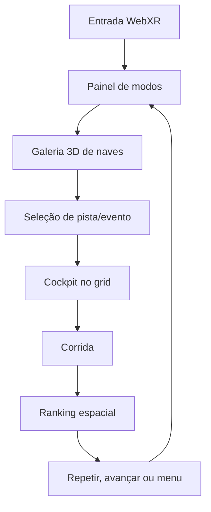

# Experiência VR e controles espaciais

## Objetivo

O Meta Quest 3 é plataforma principal, não um modo de câmera adicional. Depois de selecionar **Entrar em VR**, toda a jornada precisa ser concluída no headset: modo, nave, pista, opções, corrida, resultado e próxima ação.

## Princípios

1. A cabeça controla somente o olhar.
2. A nave e o cockpit comunicam movimento sem arrastar a visão.
3. Interfaces ficam no mundo, em distância confortável e com texto grande.
4. Os dois controles podem apontar; nenhum menu depende exclusivamente de DOM 2D.
5. O centro visual da pista permanece livre durante a pilotagem.
6. Toda entrada importante tem feedback visual e, quando suportado, háptico.

## Fluxo espacial

Nenhuma seta desse fluxo deve chamar `session.end()`.

## Ponteiros dos controles

### Visual

- Raio fino, luminoso e visível sobre fundo claro ou escuro.
- Cursor circular somente sobre um alvo válido.
- Alvo destacado ao hover com cor, escala ou emissão.
- O raio pode ficar mais curto até a superfície atingida.
- Durante a corrida, o ponteiro fica oculto até abrir pausa/mapa interativo.

### Comportamento

- Ler pose de cada `XRInputSource` a cada frame.
- Fazer raycast nos elementos do painel ativo.
- `selectstart` confirma o item atualmente destacado.
- Trava curta impede seleção dupla pelo mesmo clique.
- Se o controle desconectar, remover raio e cursor imediatamente.
- Analógico oferece navegação alternativa; botão de confirmação executa a seleção focada.

## Galeria de naves

A seleção não deve ser uma lista textual. Cada opção apresenta:

- modelo 3D girável ou em rotação lenta;
- nome e arquétipo;
- barras de aceleração, velocidade, controle, boost e estrutura;
- cores e silhueta reais da nave;
- prévia simplificada do cockpit;
- confirmação explícita antes de avançar.

## Galeria de circuitos

- O percurso selecionado aparece como modelo 3D em rotação lenta.
- A miniatura é gerada da mesma spline da corrida, sem desenho abstrato alternativo.
- Elevação, largura, lacunas, recarga e boost permanecem reconhecíveis.
- Nome, região, extensão, voltas, dificuldade e características acompanham o modelo.
- Trocar a seleção reconstrói o turntable sem encerrar a sessão VR.
- Turntables de nave e pista ficam abaixo da linha dos olhos e levemente inclinados para o jogador sentado.
- Opções de áudio ficam disponíveis no lobby e na pausa VR, usando o mesmo estado persistido do menu 2D.

## Cockpit

O cockpit pertence à nave selecionada e deve parecer um habitáculo, não uma bancada genérica.

### Elementos mínimos

- carenagem esquerda e direita com profundidade;
- painel central ou lateral coerente com a nave;
- velocímetro;
- energia/nitro;
- volta e posição;
- minimapa compacto e acionável;
- elementos de propulsão/iluminação reativos.

### Movimento

- Acompanhar guinada e inclinação da nave com suavização.
- Permitir que a cabeça se mova livremente dentro do cockpit.
- Não anexar HUD diretamente à câmera XR.
- Evitar atraso excessivo que faça o painel “sambar” separado da nave.
- Evitar acompanhamento total instantâneo que provoque desconforto.

## HUD e minimapa

- Velocidade fica abaixo da linha do horizonte, legível com rápido movimento dos olhos.
- Mapa fica no painel e não segue a cabeça.
- Jogador e oponentes usam marcadores distintos.
- Marcadores respeitam progresso de volta e fechamento do circuito.
- Mapa ampliado pode ser acionado por botão e fechado pela mesma ação.
- Não mostrar retícula circular permanente no centro da visão durante corrida.

## Conforto

- Evitar rotação artificial da câmera em túneis.
- Roll magnético deve crescer e diminuir gradualmente.
- Saltos precisam de recepção visível antes da decolagem.
- Recuperação recoloca a nave na pista com transição previsível.
- Nitro usa linhas periféricas e alteração de áudio, preservando o foco central.
- Curvas não podem fechar em V ou exigir reversão impossível em alta velocidade.
- Menus nunca surgem perto demais do rosto.

## Controles de referência no Quest

| Ação | Entrada |
| --- | --- |
| Apontar | Orientar qualquer controle |
| Selecionar | Gatilho no alvo |
| Navegar menu | Analógico esquerdo |
| Confirmar por foco | Botão principal direito |
| Voltar/pausar | Menu esquerdo quando exposto pelo navegador; clique do analógico como alternativa |
| Direção na corrida | Analógico esquerdo |
| Acelerar | Empunhadura direita |
| Frear | Gatilho esquerdo |
| Nitro | A direito |
| Usar arma | Apontar a arma da mão direita e apertar o gatilho |
| Trocar slot | B direito |
| Mapa | Botão configurado no controle esquerdo |

## Checklist no headset

- [ ] Botão Entrar em VR é reconhecido no Meta Quest Browser por HTTPS.
- [ ] Os dois controles aparecem e acompanham posição/rotação.
- [ ] A arma física acompanha a mão direita, a boca do cano coincide com a direção do disparo e some quando o slot está vazio.
- [ ] Ambos os raios atingem todos os botões visíveis.
- [ ] Painel físico exibe vidas, arma/munição e cargas de escudo.
- [ ] Os dois slots podem ser alternados com B sem interromper um domo já ativo.
- [ ] Domo do escudo permanece periférico e não reduz a leitura do centro da pista.
- [ ] Cursor e hover coincidem com a superfície do painel.
- [ ] Seleção de modo, nave e pista funciona sem sair do VR.
- [ ] Cockpit corresponde à nave escolhida.
- [ ] Turntable da pista corresponde ao percurso e ao minimapa da corrida.
- [ ] Velocímetro, energia e mapa ficam fixos na nave.
- [ ] Cabeça pode olhar para os lados sem levar o painel junto.
- [ ] Cockpit acompanha curvas sem atraso desconfortável.
- [ ] Pausa, opções, resultado e próxima corrida funcionam em VR.
- [ ] Pausa espacial permite retomar, reiniciar ou voltar ao menu principal sem encerrar a sessão XR.
- [ ] Nenhum cursor permanece no centro durante a corrida.
- [ ] FPS e resposta dos controles permanecem estáveis numa corrida completa.
